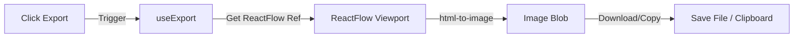

# Export Architecture Design (Day 6)

## Goal
Allow users to download the current graph as a high-quality image (PNG/SVG) or copy it to the clipboard.

## Architecture



## Decisions

1.  **Library:** `html-to-image`.
    -   **Why:** Standard for ReactFlow. Better maintenance than `dom-to-image`.
2.  **UX:** Dropdown Menu in Header.
    -   "Download PNG"
    -   "Download SVG"
    -   "Copy to Clipboard"
3.  **Implementation:**
    -   `useExport` hook encapsulates the logic.
    -   Takes a `ref` to the ReactFlow wrapper.
    -   Handles white background (by temporarily setting style) or transparent.

## Folder Structure

```
src/features/export/
├── components/
│   └── ExportDropdown.tsx   # UI Trigger
├── hooks/
│   └── useExport.ts         # Logic (html-to-image wrapper)
└── index.ts                 # Export
```

## Dependencies
-   `html-to-image`
-   `shadcn` Dropdown Menu components
