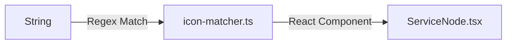

# Icon Matching & Enhanced Node Design (Day 4)

## Goal
Enhance the visual quality of the graph by mapping service image names to official brand icons (Simple Icons) and showing more details (volumes, env vars) on the nodes.

## Architecture



## Decisions

1.  **Icon Library:** `simple-icons` + `lucide-react`.
    -   **Why:** `simple-icons` has comprehensive brand logos (Postgres, Redis, Nginx, etc.). `lucide-react` provides clean generic icons.
2.  **Matching Strategy:** Regex-based priority list.
    -   Iterate through a list of `{ regex, icon }` pairs. First match wins.
    -   Fallback to generic categorization (db -> database icon, web -> globe icon).
    -   Final fallback: Generic `Box` icon.
3.  **Node Enhancement:**
    -   Show Volume count (with `HardDrive` icon).
    -   Show Environment Variable count (with `Settings` icon).
    -   Keep card compact but informative.

## Folder Structure

```
src/features/parser/
├── utils/
│   ├── icon-matcher.ts      # New file: Regex mapping logic
│   └── ...
```

## Data Types

```typescript
interface IconMapping {
  regex: RegExp;
  icon: React.ComponentType<{ className?: string }>;
  color?: string; // Optional brand color
}
```

## Proposed Mappings (Initial List)
-   `postgres`, `mysql`, `mariadb`, `mongo`, `redis` -> Database Brands
-   `nginx`, `apache`, `httpd`, `caddy`, `traefik` -> Web Servers
-   `node`, `python`, `go`, `ruby`, `php`, `java` -> Languages
-   `react`, `vue`, `angular`, `next`, `nuxt` -> Frameworks
-   `docker`, `jenkins`, `gitlab`, `github` -> CI/CD
-   `rabbitmq`, `kafka`, `elastic`, `kibana`, `prometheus`, `grafana` -> Infra

## Dependencies
-   `simple-icons` (npm package)
-   `simple-icons-react` (if available, or use `simple-icons` directly)
