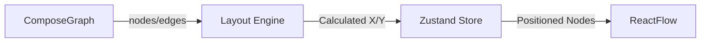

# Auto-Layout Architecture Design (Day 5)

## Goal
Replace the static grid layout with a smart hierarchical layout using Dagre. This ensures nodes are positioned automatically based on their dependencies (e.g., database nodes below web nodes).

## Architecture



## Decisions

1.  **Library:** `@dagrejs/dagre`.
    -   **Why:** Standard for hierarchical graph layout in JavaScript. Fast and deterministic.
2.  **Orientation:** Top-to-Bottom (`TB`) default.
    -   Can be switched to Left-to-Right (`LR`) later if needed via config.
3.  **Node Sizing:** Fixed assumption for now (`250px` x `150px`).
    -   Since nodes are Cards, they have roughly predictable sizes. We add padding to avoid overlap.

## Folder Structure

```
src/features/canvas/
├── utils/
│   ├── layout-dagre.ts      # New: Dagre implementation
│   └── layout-grid.ts       # Deprecated
```

## Data Flow
1.  `setGraph` action in store receives `ComposeGraph`.
2.  Passes data to `layoutDagre(graph)`.
3.  `layoutDagre` creates a `dagre.graphlib.Graph`.
4.  Adds nodes with dimensions.
5.  Adds edges.
6.  Runs `dagre.layout(g)`.
7.  Extracts X/Y coordinates back into ReactFlow Node objects.
8.  Store updates state with positioned nodes.
