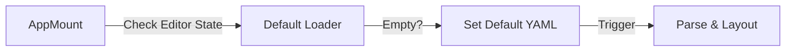

# UI Polish & Finalization Design (Day 7)

## Goal
Ensure the application feels complete, polished, and welcoming to new users by adding a rich demo dataset and refining the UI interactions.

## Architecture



## Decisions

1.  **Default Demo:** Load a comprehensive `docker-compose.yml` (Web stack + Monitoring) on initial load so the user sees a beautiful graph immediately.
2.  **Visual Tweaks:**
    -   Ensure `Editor` and `Canvas` have consistent background colors/borders.
    -   Add a "Reset to Demo" button? Maybe overkill, but good for testing.
    -   Improve the "Parse Error" display (red banner vs just text).
3.  **Deployment:** Ensure build is clean and ready for static hosting (Netlify/Vercel/Coolify).

## Folder Structure

```
src/features/editor/
├── data/
│   └── default-yaml.ts      # The demo string
└── components/
    └── Editor.tsx           # Update to load default
```

## Demo YAML Content
A realistic stack:
-   `frontend` (Node/React)
-   `api` (Go/Python)
-   `db` (Postgres)
-   `cache` (Redis)
-   `worker` (Python)
-   `monitoring` (Prometheus)
