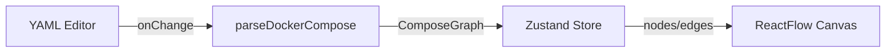

# ReactFlow Architecture Design (Day 3)

## Goal
Set up ReactFlow canvas with custom nodes (Service Card) and edges (Dependencies). Connect the YAML Editor (via Parser) to ReactFlow using Zustand state management.

## Architecture



## Decisions

1.  **Library:** `@xyflow/react` (formerly `reactflow`).
2.  **State Management:** `zustand`.
    -   **Why:** Clean separation of concerns. Easy to share state between Editor (parser output) and Canvas (graph rendering).
    -   **Store:** `useStore.ts` manages `nodes`, `edges`, `onNodesChange`, `onEdgesChange`, `onConnect`.
3.  **Node Type:** Custom `ServiceNode` (Shadcn Card UI).
    -   **Why:** Provides rich information (ports, volumes) in a visually appealing way.
    -   **Structure:** Header (Name + Icon), Body (Image, Ports), Footer (Status/Meta).
4.  **Edge Type:** Custom `DependencyEdge` (Animated SVG).
    -   **Why:** Visualizes data flow clearly. default `smoothstep` edge is fine, but custom is better for polish.

## Folder Structure

```
src/features/canvas/
├── components/
│   ├── Canvas.tsx           # ReactFlow wrapper
│   ├── ServiceNode.tsx      # Custom Node Component
│   └── DependencyEdge.tsx   # Custom Edge Component
├── hooks/
│   └── useCanvas.ts         # ReactFlow hooks (zoom, fitView)
├── store/
│   └── useCanvasStore.ts    # Zustand store (nodes, edges, actions)
├── utils/
│   └── layout-grid.ts       # Simple grid layout (Day 3 placeholder for Dagre)
└── index.ts                 # Public API
```

## Data Types (Store)

```typescript
interface CanvasState {
  nodes: Node[];
  edges: Edge[];
  onNodesChange: OnNodesChange;
  onEdgesChange: OnEdgesChange;
  onConnect: OnConnect;
  setGraph: (graph: ComposeGraph) => void;
}
```

## Initial Layout (Day 3)
Since Dagre auto-layout is Day 5, we will implement a simple grid layout function (`layout-grid.ts`) to position nodes in a grid (e.g., 3 columns) so they don't overlap initially.
